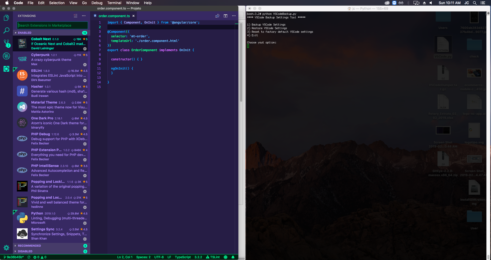

# VSCode Backup
This python script working to make a easy backup to Visual Studio Code extensions, settings and themes

## How to use ?

First you need to run a backup using the option 1. The script working and make a backup in home directory called
VSCodeBackup

## Screenshot

